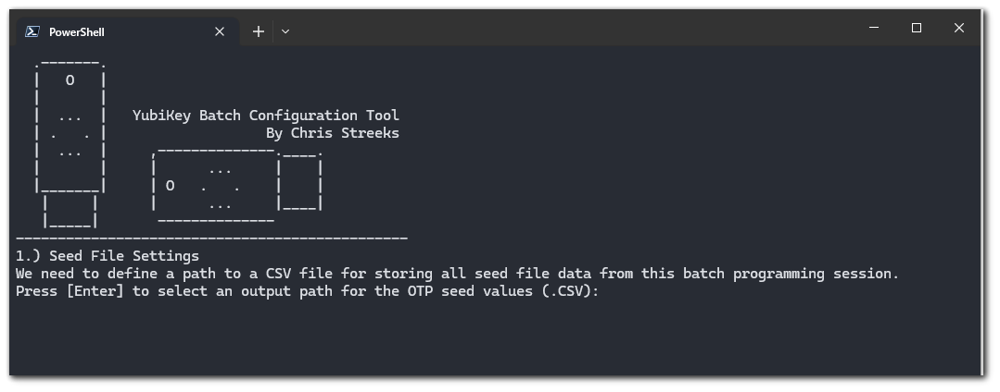

# PS Batch YubiKey Config

A YubiKey batch configuration tool for the YubiKey Manager, written in Powershell

**Core Features**
Program several YubiKeys with YubiOTP or (H/T)OTP seeds in batch. Script adds seed values to the CSV file of your choosing. 

**Additional Features**
- Visual UI to show you how far you've progressed in your batch programming session
- You may choose to batch configure an access code to each YubiKey, preventing users from reprogramming the devices
- You may choose which slot you'd like to batch configure.
- Have a lot of YubiKeys to program? No worries! This script will not let you accidentally program a YubiKey you've already programmed during a given session.
- Exports to CSV already configured for easy import into Okta/Duo/etc.

## Requirements
- Any popular operating system capable of running Powershell
- Latest version of the [YubiKey Manager 1.2.4](https://www.yubico.com/products/services-software/download/yubikey-manager/) 
- Appropriate level of permission to execute Powershell scripts.

## Security Recommendations
- Given that you'll be generating OTP seed values for a large quantity of YubiKeys into a cleartext CSV file, it is is recommended that you run this script on an offline machine, taking care to delete the CSV file once it is uploaded to the platform you're using with the YubiKeys.

- For clarity on Powershell execution policies, [please review the Microsoft documentation](https://docs.microsoft.com/en-us/powershell/module/microsoft.powershell.core/about/about_execution_policies?view=powershell-7)

- As a general rule of thumb, **never** run powershell scripts that you do not understand. This script is open source and well documented for a reason! Feel free to review the script yourself and/or ask questions in the form of a GitHub Issue.

## How to Use (YubiOTP)
1. Ensure the YubiKey Manager is installed. 
2. Launch PS_Batch_YubiKey_Config.ps1
3. Click Enter on the keyboard when prompted to select a location for the CSV file which will hold the OTP seeds.
4. Choose whether or not to set an access code to the YubiKeys. (If Yes, The access code will be set to the serial number of the YubiKeys.)
5. Insert the first YubiKey to program and press the [Enter] key to begin batch programming.
6. To finish programming, simply press Control + C or close the Powershell window. Throughout the session, the script will append to the CSV file that you defined.
7. Upload the CSV file to the desired platform, delete the CSV file from your machine.

## How to Use (HOTP)
1. Ensure the YubiKey Manager is installed.
2. Launch the .ps1 file with the hotp flag attached. **PS_Batch_YubiKey_Config.ps1 -hotp**
3. Click Enter on the keyboard when prompted to select a location for the CSV file which will hold the OTP seeds.
4. Choose whether or not to set an access code to the YubiKeys. The access code will be set to the serial number of the YubiKeys.
5. If you choose to set an access code, you will be additionally prompted to set a location to store those access codes.
6. Insert the first YubiKey to program and press the [Enter] key to begin batch programming.
6. To finish programming, simply press Control + C or close the Powershell window. Throughout the session, the script will append to the CSV file that you defined.
7. Upload the CSV file to the desired platform, delete the CSV file from your machine.

## How to Use (TOTP)
1. Ensure the YubiKey Manager is installed.
2. Launch the .ps1 file with the totp flag attached. **PS_Batch_YubiKey_Config.ps1 -totp**
3. Click Enter on the keyboard when prompted to select a location for the CSV file which will hold the OTP seeds.
4. Define the issuer name. As an example, if these are being set up for Microsoft Office 365, "Office 365" might be a good issuer name.
5. Insert the first YubiKey to program and press the [Enter] key to begin batch programming.
6. To finish programming, simply press Control + C or close the Powershell window. Throughout the session, the script will append to the CSV file that you defined.
7. Upload the CSV file to the desired platform, delete the CSV file from your machine.

## Microsoft Azure Additional Notes
1. After programming the YubiKeys, the CSV file will still lack your user's UPN information. Proceed accordingly.

## Optional Flags 
**slot2** - YubiKeys will be programmed in their second slot rather than the default slot 1. 

**hotp** - YubiKeys will be programmed with HOTP seeds rather than the default YubiOTP

**totp** - YubiKeys will be programmed with TOTP seeds to the YubiKey's OATH module. This requires the user to use the Yubico Authenticator app to generate TOTPs.

**ignoreduplicates** - Script will not check if a YubiKey has already been programmed during the session

**whatif** - Script will not program YubiKeys and will instead write to the defined CSV file with dummy data. 

